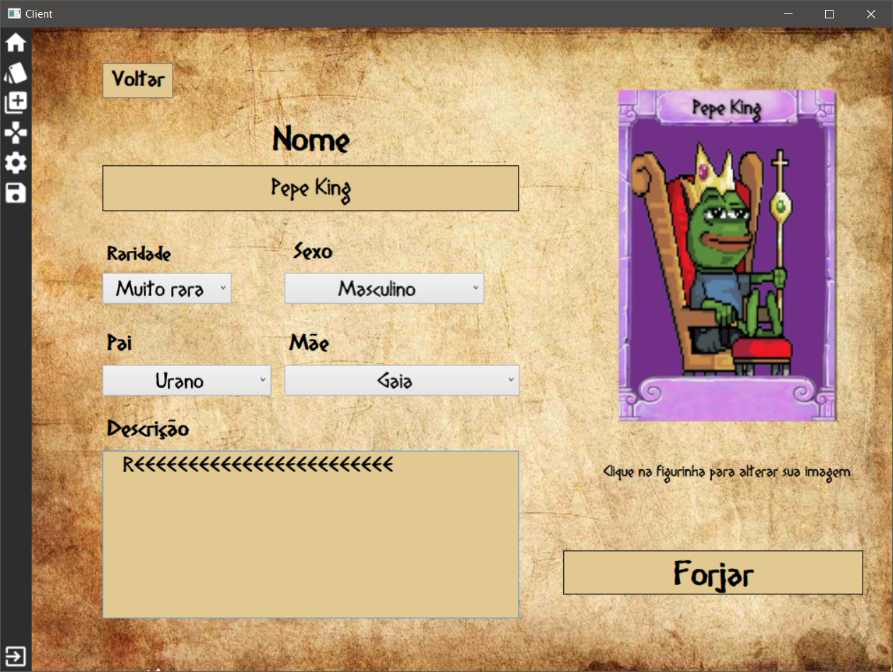
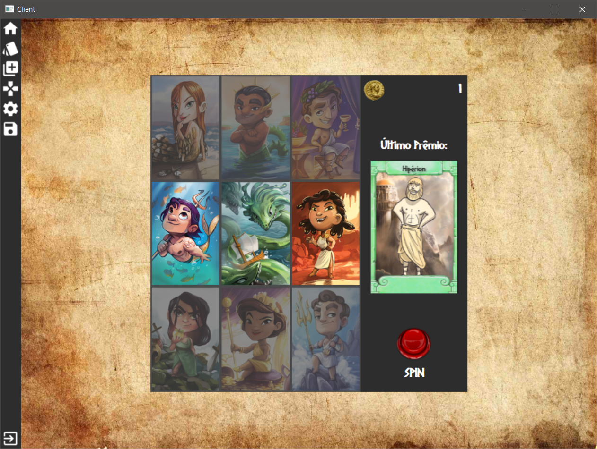
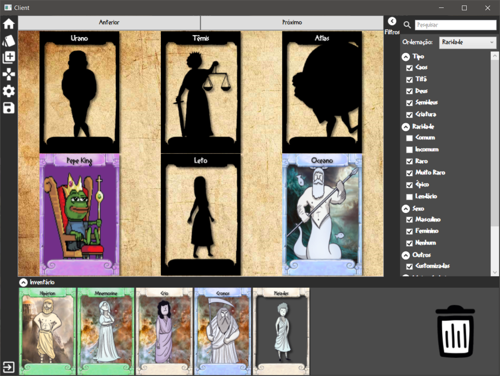

# sticker-album is a Computer Engineering assignment for Faculdade de Tecnologia Termomecanica finished in June 2018.

## Game preview: 

### Sticker Creation:

   

### Minigame (to obtain more stickers!):

   

### Album Page:

   

## Install instructions:

 1. Add NAudio & Newtonsoft dependencies through NuGet Packages if needed
 1. Build Project
 1. Extract "assets.rar" to game folder (usually "Debug" or "Release")
 1. Install "Diogenes" font inside "fonts" directory
 1. Run!
